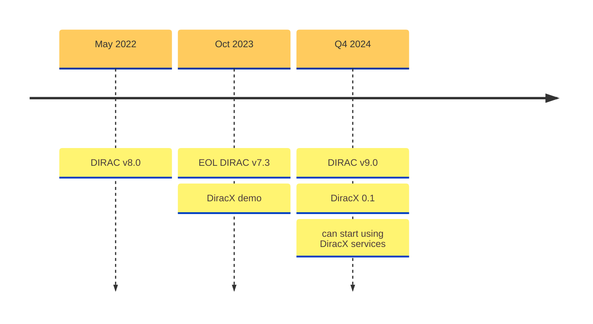
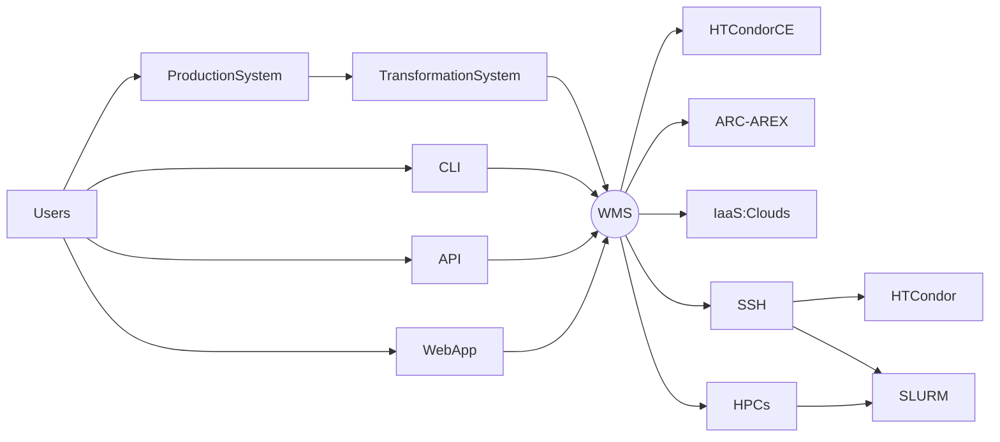

 

 </img>

---
layout: image-right
image: images/Groupe_dirac.jpg
---

# Logistics

 

The workshop took place over 3 days:
- Wednesday afternoon
- Thursday 
- Friday morning

 

In Lyon, CC-IN2P3 

 </img>

 

"Only" 26 registered **"Users"** -- I would call them **"Experts"**.
- Most of them Dirac administrators and developers

---
layout: image-left
image: images/DUW10_agenda.png
---

# Agenda

Presentations only in the first 2 days (community reports + developers reports) 

Zoom was on, but *almost* un-attended -- this was in large an old-style f2f meeting!
Discussions were highly encouraged, and we had **lots** of them.

 

**We were there to *get things done***

 

The **hackathon** part lasted 1 afternoon and 1 morning. 

Thursday afternoon, we formed 2 groups:
1. following instructions, [run a DiracX server on a k3s server](https://github.com/DIRACGrid/diracx-charts/tree/master/k3s)
2. "free" discussions/hacking sessions

On Friday morning we split in "free", smaller groups, for discussions/hacking sessions

---

# Communities reports

 

- Single-VO installations: LHCb, Belle2, CTAO
- Multi-VO installations: EGI (20), GridPP (11), IHEP (4), CERN/SFT (3)

In total, there are at least 41 known communities using Dirac, supporting the work of thousands of scientists (not all Users/Admins were there to report).

 

### Major points:
- Large differences in terms of what are their:
  - workflows
  - computing needs
  - data management and access requirements
- Some installations/communities expose Dirac to all their users, others only to power users.
- "Institutionalized" productions predominant.
- Several complains received for the lack of general resource information index[^1]

[^1]: BDII **was** the only way for several small-medium community to know which VO could run and where.

---

# EL7 EOL, and the supposed death of VOMS-Admin

A number of actions followed the EOL of EL7 -- some rather techinical (not listed here).

- LHCb made an (successful) effort for moving VOMS-Admin to IAM before the end of June (and everything done is available to the other communities)
- to our slight surprise, other communties using DIRAC did not do the same

---

# DiracX: reminders

 

## DiracX is the neXt DIRAC incarnation

 

It is **a complete rewrite** of DIRAC, but the DBs are staying!

 </img>

---
layout: two-cols
---

# Versions

 

Current **production** version: **DIRAC v8** --> this is *the only* supported version at the moment
- Used by *almost* all installations -- at least by everyone present at the workshop

**Development** version: **DIRAC v9**, which will come together with **DiracX 0.1** (the 2 can not be disentangled)
- Expected Q4 2024 (aiming to annouce at CHEP)
- The central developers' team will actively provide help with the transitioning

::right::

 

---
layout: center
---

# WMS developments

Notable developments:
- Pilot jobs are actively developed (notable better integration with CVMFS)
- "Push" solution for HPCs that do not support pilots (because of limited internet access). Used in production, actively developed.
- We are starting to integrate [CWL (Common Workflow Language)](https://www.commonwl.org) as a way of defining jobs (replacing JDL) -- will be in DiracX.

---
layout: two-cols
---

# DiracX

   

## Requirements for v0.1: 

- Stable underpinnings
  - interfaces for services, dbs, auth
- No schema changes beyond what Dirac v9 requires
- Support for extensions (true Multi-VO)
- Support for Legacy Adapter (i.e Dirac -> DiracX interactions)
  - One fully supported service: JobStateUpdate
- Complete administration documentation
  - Including how to run with K3s

::right::

---
layout: image-right
image: images/IHEP.jpg
---

# Future events

## Next DiracX hackathon

17th - 18th September, at CERN : https://indico.cern.ch/event/1431888/

  

## Dirac+Rucio mini-workshop and hackathon

Sometimes in January (or February) 2025 at CERN

  

## **Next Dirac Workshop**

In IHEP, Beijing, September 18th-20th September 2025 : https://indico.cern.ch/e/duw11

---
layout: center
---
# In summary

  
This was a very fruitful workshop. Mostly face-to-face.

More of a longer hackathon (with few presentations).

Not a big community, but a very active one.

The DIRAC+Rucio bundle is used in production only by Belle2, but CTAO, Juno, BESIII actively looking for adopting it.
The experience of Belle2 will be useful for all of them.

 

### DiracX is in active development
- will live together with DIRAC v9 for a while
- foundations are there
- plans to ease the interoperability with Rucio (DiracX will still have the Data Management part)

---
layout: center
class: text-center
---

<h1 style="font-size: 10em; font-weight: bold;">?</h1>

 </img>

