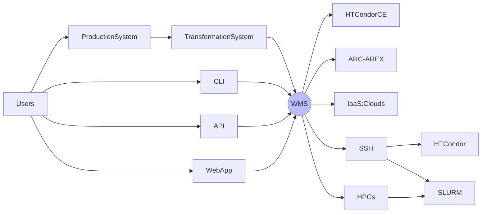
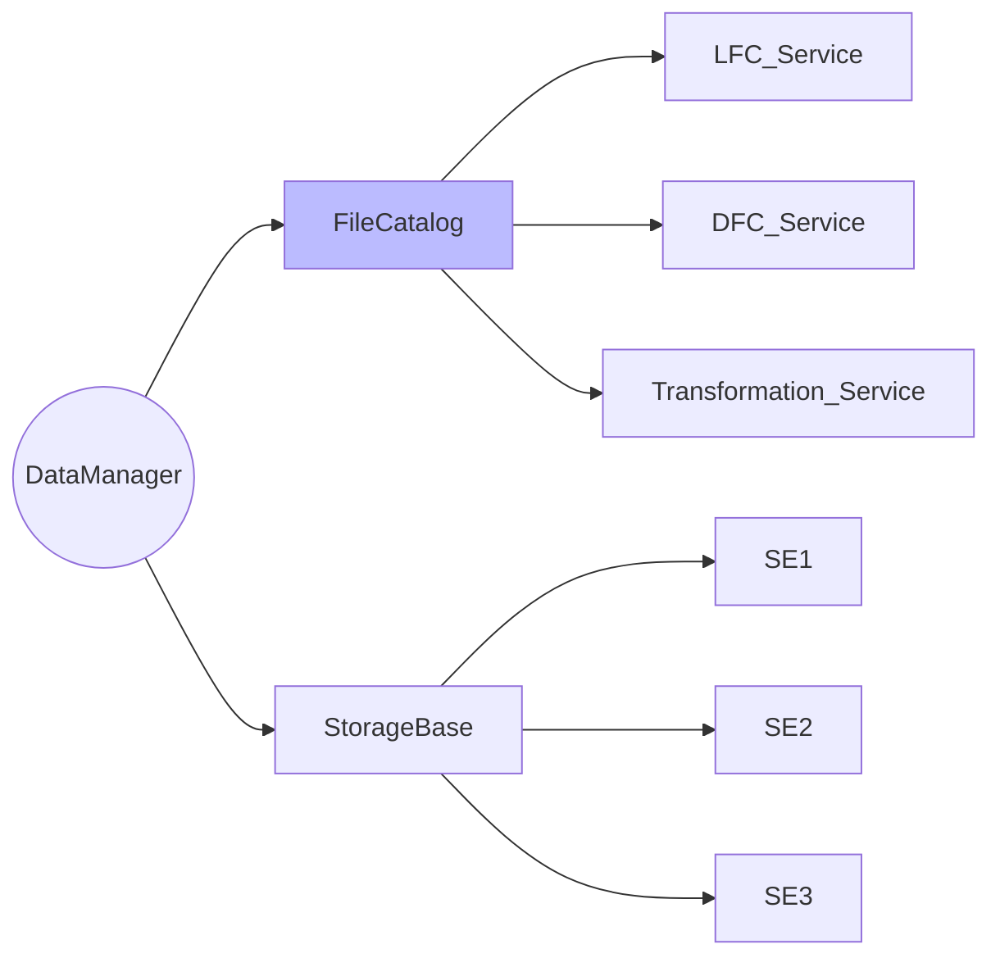
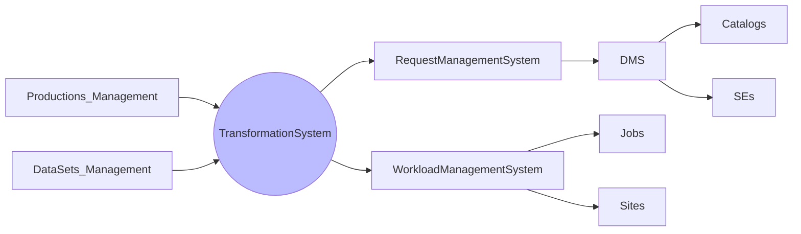
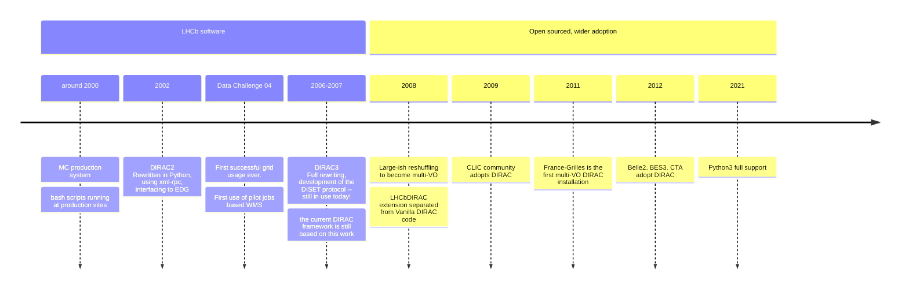
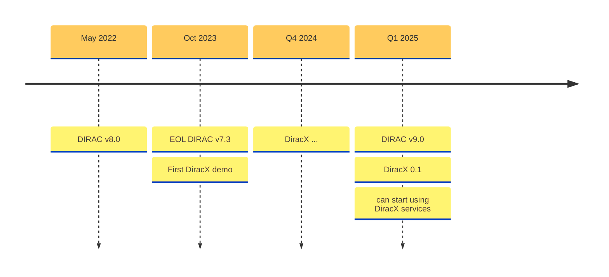

# The neXt Dirac incarnation

**Federico Stagni** <Email v="federico.stagni@cern.ch" />

October 25th 2024
__ <a href="https://indico.cern.ch/event/1338689/" class="ns-c-iconlink"><mdi-open-in-new />CHEP 2024</a>  


---
layout: section
color: lime-light
---

## This is the story of why and how we decided to take a successful project, and rewrite it from scratch


---
layout: section 
color: lime-light
---

<div style="display: flex; align-items: center; justify-content: center;">
    
    <span style="margin: 0 50px;">--></span>
    
</div>


---
layout: section
color: cyan-light
---

## What is DIRAC?


---
layout: iframe-left
title: DIRAC
url: https://dirac.readthedocs.io/en/latest/
class: DIRAC
slide_info: false
color: gray-light
---

# Used by several communities 


---
layout: side-title
align: lm-lm
color: gray-light
title: WMS
---

:: title ::

# Workload Management System
- Pull model based on Pilot jobs
- Also "Push" solution for HPCs that do not support pilots (because of limited internet access).
- Will integrate [CWL (Common Workflow Language)](https://www.commonwl.org) as a way of defining jobs (replacing JDL)

:: content ::



---
layout: side-title
align: lm-lm
color: gray-light
title: DMS
---

:: title ::

# Data Management System
It’s about **files**:​ placing, replicating, removing files​

- there are **LFNs** (logical file names) → and users ONLY work with these​
- **LFNs** are registered in *catalog(s)​*
    - where are the LFNs? (in the DIRAC File Catalog (DFC), or in Rucio)​
    - what are their metadata? (in the DFC, or in the LHCb Bookkeeping, or in AMGA)​
- LFNs *may* have **PFNs**, stored in **SEs**.​
- You can access those PFNs with several protocols.​

:: content ::




---
layout: side-title
color: gray-light
align: lm-lm  
title: Productions
---

:: title ::

# Productions and Dataset management

- A `production` is a *Data Processing transformation* (e.g. Simulation, Merge, DataReconstruction…). A Production creates jobs in the WMS (and re-sumbit them, and destroy them).​

- (Unless you are using Rucio) a *Data Manipulation transformation* replicates, or remove, data from storage elements.

:: content ::

<span class="bg-red-100 text-red-600 p-2 border-l-6 border-2 border-red-400 rounded-lg pl-4 pr-4">The **Transformation System (TS)** is used to automate common tasks related to production activities</span>



---
layout: top-title
color: gray-light
align: l
title: history
---

:: title ::

# Brief history of DIRAC

:: content ::



---
layout: side-title
align: rm-lm
color: red
titlewidth: is-2
title: issues
--- 

:: title ::

# DIRAC issues

:: content ::

<ul class="text-sm mx-auto">
    <li> complex, with high entrance bar</li>
    <li> somewhat cumbersome deployment</li>
    <li> late on “standards”
        <ul class="text-vs mx-auto">
            <li> http services</li>
            <li> tokens</li>
            <li> monitoring</li>
        </ul>
    </li>
    <li> “old”-ish design (RPC, “cron” agents…)</li>
    <li> not very developer-friendly: rather un-appealing/confusing, especially for new (and young) developers</li>
    <li> multi-VO, but was not designed to do so since the beginning</li>
    <li> no clear interface to a running DIRAC instance</li>
</ul>

---
layout: section
color: cyan-light
---

## DiracX,  the neXt DIRAC incarnation


---
layout: side-title
side: left
color: gray-light
titlewidth: is-5
align: rm-lm
title: CLI
---

:: title ::

# What is DiracX?

:: content ::

- A cloud native app
- Multi-VO from the get-go
- Standards-based
- Still DIRAC, in terms of functionalities


---
layout: iframe-right
title: Web API
url: https://diracx-cert.app.cern.ch/api/docs
class: webAPI
slide_info: false
color: gray-light
---

# DiracX Web API

- DIRAC Web APIs are developed using FastAPI
- Nicely documented in Swagger (or Redoc), this what you see on the right

<AdmonitionType type='caution' >
What is on the right is the certification WebApp, loaded live. Use with caution!
</AdmonitionType>

---
layout: side-title
side: left
color: gray-light
titlewidth: is-2
align: rm-lt
title: CLI
---


:: title ::

# <mdi-code-braces /> CLI

:: content ::

Scrollable with clicks 🤯

```python {2|3|7|12}{maxHeight:'100px'}
function helloworld() {
  console.log('Hello, World 1!')
  console.log('Hello, World 2!')
  console.log('Hello, World 3!')
  console.log('Hello, World 4!')
  console.log('Hello, World 5!')
  console.log('Hello, World 6!')
  console.log('Hello, World 7!')
  console.log('Hello, World 8!')
  console.log('Hello, World 9!')
  console.log('Hello, World 10!')
  console.log('Hello, World 11!')
}

```

You can even edit the code in the browser

```ts {monaco}
console.log('HelloWorld')
```

You can even run the code in the browser

```sh
curl -X 'GET' \
  'https://diracx-cert.app.cern.ch/api/jobs/status?job_ids=123' \
  -H 'accept: application/json'
```

<SpeechBubble position="t" color='orange' shape="round" maxWidth="300px">
**REST API**, so use your own language
</SpeechBubble>


---
layout: iframe-left
title: WebApp
url: https://diracx-cert.app.cern.ch
class: webapp
slide_info: false
color: gray-light
---

# DiracX web

We are also rewriting the WebApp from scratch.

Software stack:
- NextJS
- Material UI
- TypeScript

https://github.com/DIRACGrid/diracx-web

<AdmonitionType type='caution' >
What is on the left is the certification WebApp, loaded live. Use with caution!
</AdmonitionType>


---
layout: top-title
color: gray-light
align: l
title: tokens
---

:: title ::

# From X509 certs and proxies to tokens

:: content ::

DIRAC uses X509 certificates and proxies to verify identities. DiracX uses tokens. For a (long) while, **users will have both a token and proxy**.

---
layout: default
color: gray-light
---

# Architecture diagram


---
layout: top-title
color: gray-light
align: l
title: Migration
---

:: title ::

# Migration from DIRAC

:: content ::

- at the moment, it is not possible to run DiracX standalone
- DIRAC v9 and DiracX will need to live together for a long while


---
layout: top-title
color: gray-light
align: l
title: Versions
---

:: title ::

# Versions

:: content ::



<SpeechBubble position="r" color='cyan' shape="round"  v-drag="[20,211,148,240]">
Current production and only supported version, used by all DIRAC installations
</SpeechBubble>


<SpeechBubble position="l" color='amber' shape="round"  v-drag="[820,265,140,175]">
DIRAC v9 and DiracX 0.1 will be released together.
</SpeechBubble>

---
layout: top-title
color: gray-light
align: l
title: Extensions
---

:: title ::

# On extending DiracX

:: content ::

The ol'good DIRAC is extendable: from the main code (DIRAC) to the Web and the Pilot, communites can create/run extensions.

DiracX follows the same path, including DiracX-Web. We also provide a reference extension, dubbed "gubbins"


---
layout: top-title
color: gray-light
align: l
title: Development
---

:: title ::

# Development phylosophy

:: content ::


---
layout: side-title
color: gray-light
title: Contribute
align: lm-lm
titlewidth: is-5
---

:: title ::

<IceCream :size="150" mood="lovestruck" color="#FDA7DC" />

<SpeechBubble position="l" shape="round"  color='pink-light'>
I want to contribute
</SpeechBubble>

:: content ::

Several areas of contribution are possible, but of course:

- tests: (as you could see we have a somewhat open test deployment infrastructure). You *can* try something out!
- code: https://github.com/DIRACGrid/diracx

Run the demo: 

```sh
git clone https://github.com/DIRACGrid/diracx-charts
diracx-charts/run_demo.sh  # do not do it now!
```

Discuss:
- in meetings: (almost) every week on Thursday morning (CET)
- hackathons: we have been doing 2-days DiracX hackathons every quarter. At CERN. Next one in January: https://indico.cern.ch/event/1458873/
- mattermost : https://mattermost.web.cern.ch/diracx/


---
layout: top-title-two-cols
align: cm-cm-lm
color: orange-light
titlewidth: is-5
title: summary
--- 
:: title ::

# Summary


:: left :: 

 </img>

:: right ::

### DiracX is in active development
- It will live together with DIRAC v9 for a while
- Foundations are there, the first release will soon be here
- We plan to ease the interoperability with Rucio
    - DiracX will still have the Data Management part, but WMS will come first


---
layout: credits
color: navy
loop: true
speed: 0.4
---

<div class="grid text-size-4 grid-cols-3 w-3/4 gap-y-10 auto-rows-min ml-auto mr-auto">
    <div class="grid-item text-center mr-0- col-span-3">
        <strong>People</strong><br> 
    </div>
    <div class="grid-item text-right mr-4 col-span-1">
        <strong>DiracX is an idea of</strong>
    </div>
    <div class="grid-item col-span-2">
        Chris Burr <i>CERN, LHCb</i><br/>
        Christophe Haen <i>CERN, LHCb</i>
    </div>
    <div class="grid-item text-right mr-4 col-span-1">
        <strong>Current Developers</strong>
    </div>
    <div class="grid-item col-span-2">
        Alexandre Boyer <i>CERN, LHCb</i><br/>
        Natthan Piggoux <i>LUPM (FR), CTA</i><br/>
        Cedric Serfon <i>Brookhaven National Laboratory (US), Belle2</i><br/>
        Ryunosuke O'Neil <i>CERN, LHCb</i><br/>
        Jorge Lisa Laborda <i>Univ. of Valencia and CSIC (ES), LHCb</i><br/>
        Janusz Martyniak <i>Imperial college (UK), GridPP</i><br/>
        Bertrand Rigaud <i>IN2P3 (FR)</i>
    </div>
    <div class="grid-item text-right mr-4 col-span-1">
        <strong>Project lead</strong>
    </div>
    <div class="grid-item col-span-2">
        Federico Stagni <i>CERN, LHCb</i><br/>
        Andrei Tsaregorotsev <i>CPPM (FR), EGI and LHCb</i>
    </div>
    <!-- <div class="grid-item text-right mr-4 col-span-1">
        <strong>Software (very limited list)</strong>
    </div>
    <div class="grid-item col-span-2">
        FastAPI<br/>
        MySQL/PostGres<br/>
        OpenSearch<br/>
        MinIO<br/>
        K8 and Helm
    </div> -->
</div>

&nbsp;
&nbsp;
&nbsp;
&nbsp;
&nbsp;
&nbsp;


<div class="grid-item col-span-3 text-center mt-180px mb-auto font-size-1.5rem">
    <strong>Questions?</strong>
</div>


---
layout: side-title
align: rm-lm
color: light
titlewidth: is-5
title: QR
--- 

:: title ::

# QR codes for your fun

# <mdi-arrow-right />

:: content ::

WebApp:

<QRCode value="https://diracx-cert.app.cern.ch" :size="180" render-as="svg" />

<br />

WebAPI:

<QRCode value="https://diracx-cert.app.cern.ch/api/docs" :size="180" render-as="svg" />

<br />

